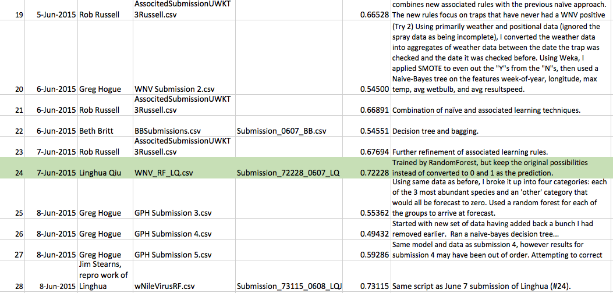
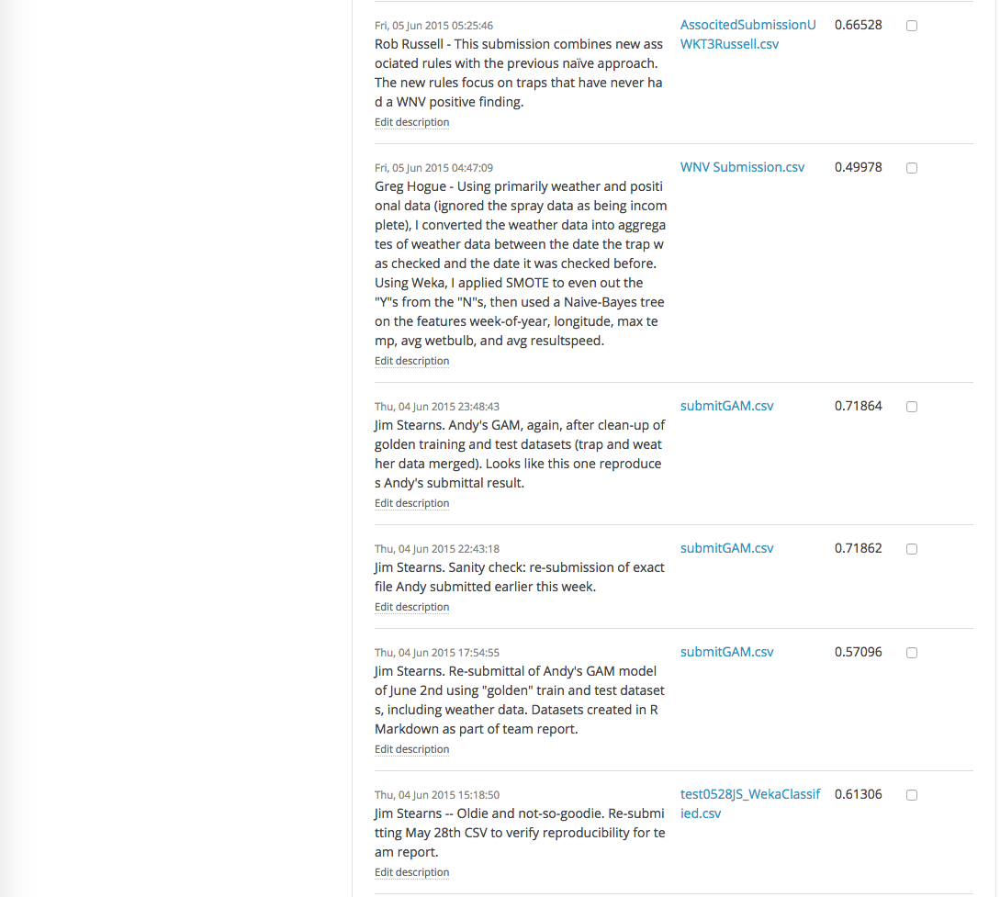

# 0. Introduction

The culminating project of the Spring 2015 UW PCE Data Science course "Data at Scale" was to participate in a Kaggle data science competition. Instructor Dr. Barga chose the [West Nile Virus Prediction](https://www.kaggle.com/c/predict-west-nile-virus) competition.

The class was broken up into three teams of roughly 8 students. This is the report of the third team with the Kaggle name of UWKT3.

## 0.1 Background

The West Nile Virus Prediction (WNVP) competition's goal was to "Predict West Nile virus in mosquitos across the city of Chicago.":


The WNVP contest started on April 22nd and will end 17 June 2015. UWKT3's first submission was on May 12th. The last covered by this report was on June 8th.

## 0.2 Team Goals

1. Experiment with modelling alternatives on a real-world dataset.
2. Learn how to participate in a Kaggle competition.
3. Create reproducible "golden" train and test datasets that could form the basis of multiple modeling experiments.
4. Non-Goal: win the competition, or even score highly.

## 0.3 Team Members

* Bethene Britt
* Andrew Ewing
* Gregory Hogue
* Patrick Leahy
* Linghua Qiu
* Chris Ross
* Robert Russell
* Jim Stearns

## 0.4 Summary of Submissions

As of 9AM on the due date of June 9th, seven UWKT3 team members had made a combined total of 28 submissions. The highest UWKT3 Area-Under-Curve score was 0.73115:


The current overall leading score, by "nhlx5haze", is 0.87196. Our current rank is 547th out of 1224 individuals and teams making at least one submission.

# 1. Data Preparation

A goal of the team project was to create a "golden" train and test dataset that could form the basis of many modeling experiments.

## 1.1 Obtain Original Datasets from Kaggle Website

Download the training, test, spray, and weather data from the Kaggle web site page for West Nile Virus Prediction.

Please see Appendix for R (and Python) code that:

* General Setup: Clears environment, sets working directory, loads libraries, define utility functions
* Downloads the data from the Kaggle site and unzips them. 

```{r Setup, echo=FALSE, results='hide',message=FALSE}
# Clear the working environment of variables, data, functions
rm(list=ls())

# Set working directory for this Kaggle project. Default: pwd.
#kaggleProjHomeDir <- "."
kaggleProjHomeDir <- "/Users/jimstearns/GoogleDrive/Learning/Courses/UWPCE-DataScience/Course3_DataAtScale/KaggleProject/Reports"
setwd(kaggleProjHomeDir)
getwd()

#install.packages("rPython")  # For download from web site with login/pwd.
library(rPython) # For calling python function to download file w/login+pwd
# Package for writing Weka ARFF file format
stopifnot(require("foreign"))
library("foreign")
# Package for calculating great circle distances
stopifnot(require("geosphere"))
library("geosphere")

# Return a data frame with the named column(s) moved to last position. 
# Intended usage: move the output classification, WnvPresent, to the last column position.
moveColsToLast <- function(df, colsToMove) {
    df[c(setdiff(names(df), colsToMove), colsToMove)]
}

moveColsToFirst <- function(df, colsToMove) {
    df[c(colsToMove, setdiff(names(df), colsToMove))]
}
```

```{r GetDatasetsIntoInputDir, echo=FALSE, results='hide',message=FALSE}
wnvpTrainFilename <- "train.csv"
wnvpTestFilename <- "test.csv"
wnvpWeatherFilename <- "weather.csv"
wnvpSprayFilename <- "spray.csv"
kaggleDatasets = c(
    wnvpTrainFilename, 
    wnvpTestFilename, 
    wnvpWeatherFilename, 
    wnvpSprayFilename)
dataSubDir <- "input"  # Kaggle convention
workingSubDir <- "working" # Kaggle convention: massaged datasets - and output - go here.

wnvpTrainFileNRecs <- 10506 # Observation records in training file. Excludes header record.
wnvpTestFileNRecs <- 116293 # Records in test file supplied by Kaggle. Submission record cnt must match.
# If download from Kaggle required, and user and pwd are empty (default),
# then user will be prompted for these two values.
kaggleUsername <- ""
kagglePassword <- ""

allKaggleFilesArePresent <- function() {
    filesAllFound <- TRUE
    for (file in kaggleDatasets) {
        if (!file.exists(paste0(dataSubDir, "/", file))) {
            print(paste("Error: could not find unzipped Kaggle file in PWD:", file))
            filesAllFound <- FALSE
        }
    }
    return(filesAllFound)
}

downloadMissingKaggleFiles <- function() {
    python.load("src/UrlFileDownloaderWithLogin.py")
    
    kaggleUsername = Sys.getenv("kaggleUsername")
    kagglePassword = Sys.getenv("kagglePassword")
    if (kaggleUsername == "" || kagglePassword == "") {
        print("Please assign kaggleUsername and kagglePassword environment variables.")
        print("Place in ~/.Renviron entries such as kaggleUsername='YourName'.")
    }
    stopifnot(!(kaggleUsername == ""))
    stopifnot(!(kagglePassword == ""))
    
    wnvpKaggleDataUrl <- 
        "https://www.kaggle.com/c/predict-west-nile-virus/download/"
    
    for (file in kaggleDatasets) {
        if (file.exists(file))
            next
        
        urlOfZip <- paste0(wnvpKaggleDataUrl, file, ".zip")
        print(urlOfZip)
        # Use a python method to download from URL with login and password.
        # Download to subdirectory "input" and filename w/o the .zip suffix.
        python.call("Download", urlOfZip, 
                    kaggleUsername, kagglePassword , 
                    paste0(dataSubDir, "/", file, ".zip"))
    }
}

unzipDownloadedFiles <- function() {
    for (file in kaggleDatasets) {
        zippedFile <- paste0(dataSubDir, "/", file, ".zip")
        print(paste0("Unzip: ", zippedFile))
        if (file.exists(zippedFile)) {
            if (file.exists(file)) {
                print(sprintf("Warning: removing existing file %s\n", file))
                file.remove(file)
            }
            unzip(zippedFile, exdir=dataSubDir)
            print(sprintf("Unzipped: %s\n", zippedFile))
        }
    }
}

if (!allKaggleFilesArePresent()) {
    print(paste("Not all needed Kaggle datasets are present in PWD;",
                "attempting to download from Kaggle web site."))
    downloadMissingKaggleFiles()
    unzipDownloadedFiles()
}

```

```{r}
stopifnot(allKaggleFilesArePresent())
print("All unzipped Kaggle datasets found in PWD. Proceeding.")
```

## 1.2 Read Kaggle Train/Test Files

* Read in test and train csv-format files into data frames.

```{r CreateMasterTrainAndTestDatasets}
test_df <- read.csv(paste0(dataSubDir, "/", wnvpTestFilename))
train_df <- read.csv(paste0(dataSubDir, "/", wnvpTrainFilename))
# Quick sanity check: got right number of records?
stopifnot(nrow(train_df) == wnvpTrainFileNRecs)
stopifnot(nrow(test_df) == wnvpTestFileNRecs)
```

## 1.3 Feature Selection/Creation

* Make the train and test datasets have the same attributes:
    * Train: Convert the WnvPresent column from numeric to factor with levels "Yes" and "No".
    * Train: Add an Id attribute, set to zero.
    * Train: Remove NumMosquitos attribute. Potentially useful, but not available in Test dset.
    * Test: Add a WnvPresent factor column, all with "No" level.
    * Both: Remove the address attributes of little use compared to Lat/Long: 
        * Address, Block, Street, AddressNumberAndStreet, AddressAccuracy.
    * Both: Add bit vectors of each of the levels of the Species factor (a new column for each of the factor levels, with a zero or 1 value). Leave the Species as well.
    * Both: Convert date into date format, add "Year", "Month", and "Week" factor attributes.
   
Please see Appendix A.3 below for a listing of the R source that performs these steps.

```{r FeatureFixupAndCreation, echo=FALSE, results='hide',message=FALSE}

# WnvPresent. Train: convert to factor. Test: add as factor, default value of "No".
train_df$WnvPresent <- factor(train_df$WnvPresent, labels=c("No", "Yes"))
WnvPresent <- factor("No", levels=c("No","Yes"))
test_df <- cbind(test_df, WnvPresent)

# Train: Add Id attribute to match that in Test. Set to 0. Id in Test is 1-relative.
train_df["Id"] <- 0
train_df <- moveColsToFirst(train_df, "Id")

# Train: Remove NumMosquitos attribute. Potentially useful, but not available in Test dset.
train_df$NumMosquitos <- NULL

# Both: Remove the block attributes of little use: 
attrsToRemove <- c("Address", "Block", "Street", "AddressNumberAndStreet", "AddressAccuracy")
train_df <- train_df[,!names(train_df) %in% attrsToRemove]
test_df <- test_df[,!names(test_df) %in% attrsToRemove]

# For creation of factor attributes, temporarily combine train and test into one dataset
# so that factor levels are the same when both are written out as separate files.
# Keeps Weka happy.
# Add a temporary column distinquishing train from test dataset entries.
train_df$DsetType <- "Train"
test_df$DsetType <- "Test"

combined_df = rbind(train_df, test_df)

# Both (in Combined): Add bit vectors for Species, one column for each factor level
# TODO: "UNSPECIFIED CULEX" needs attention.
combined_df <- with(combined_df, cbind(model.matrix( ~ 0 + Species, combined_df), combined_df))

# Both (in Combined): Convert date into date format, 
# add "Year", "Month", and "Week" factor attributes.
# as.Date() tries %Y-%m-%d by default, but what the heck, explicitly state the format.
combined_df$Date <- as.Date(combined_df$Date, format="%Y-%m-%d")

combined_df$Year <- as.factor(format(combined_df$Date, "%Y"))
combined_df$Month <- as.factor(format(combined_df$Date, "%m"))
combined_df$Week <- as.factor(format(combined_df$Date, "%U"))

# Move temporary dsetType and date-related attributes to left, leaving WnvPresent last
combined_df <- moveColsToFirst(combined_df, c("DsetType", "Id", "Date", "Year", "Month", "Week"))

# Do not remove the Species attribute - not all models will use the bit vectors.
#train$Species <- NULL
#test$Species <- NULL
```

## 1.4 Feature Creation (ctd): Merge Weather Data with Trap Observations in Train/Test Datasets

### Calculate Distance of Trap from the Two Weather Stations

* Both (in Combined): Calculate the distance (using lat/long) of the trap from the two weather stations, adding attributes with the value in kilometers. Patience: This takes a while (~5 minutes).
* Both (in Combined): Add a nearest weather station attribute.

Using function *distCosine* in [R Geosphere Package](http://cran.r-project.org/web/packages/geosphere/geosphere.pdf) to calculate distance on a sphere.

```{r WeatherStationDistances, cache=TRUE} 
# Station 1: O'Hare
station1LongLat <- c(-87.933, 41.995)
    
# Station 2: Midway
station2LongLat <- c(-87.752, 41.786)

# Patience. This takes a while (~5 minutes)
for (i in 1:nrow(combined_df)) {
    combined_df$Station1DistKm[i] <- distCosine(
        c(combined_df$Longitude[i], combined_df$Latitude[i]), station1LongLat) / 1000
    combined_df$Station2DistKm[i] <- distCosine(
        c(combined_df$Longitude[i], combined_df$Latitude[i]), station2LongLat) / 1000
}
combined_df$NearestStation <- ifelse(
    combined_df$Station1DistKm <= combined_df$Station2DistKm, 1, 2)
```

* Both (in Combined): Merge in temperature and wind data from nearest station on that date.

```{r MergeWeatherData}
weather_df <- read.csv(paste0(dataSubDir, "/", wnvpWeatherFilename), stringsAsFactors=FALSE)
colsToKeep <- c("Station", "Date", "Tmax", "Tmin", "Tavg", "AvgSpeed")
weatherData <- weather_df[,names(weather_df) %in% colsToKeep]
weatherData$Date <- as.Date(weatherData$Date, format="%Y-%m-%d")
# Tmax and Tmin come in as type int. Tavg, however, comes in as chr.
weatherData$Tavg <- as.integer(weatherData$Tavg)
# So does AvgSpeed.
weatherData$AvgSpeed <- as.numeric(weatherData$AvgSpeed)

combinedww <- merge(combined_df, weatherData, 
                             by.x=c("Date", "NearestStation"), by.y=c("Date", "Station"), 
                             all.x=TRUE)
#str(combinedww)

# Make "Id" the first column and "WnvPresent" the last.
combinedww <- moveColsToFirst(combinedww, "Id")
combinedww <- moveColsToLast(combinedww, "WnvPresent")

stopifnot(nrow(combinedww) == (wnvpTrainFileNRecs + wnvpTestFileNRecs))
```

Weather data does have some NA fields (warning above: "Warning: NAs introduced by coercion"), 
but not the subset merged into train and test dset.
Throw an exception if that ever proves not to be the case.

```{r StopIfWeatherDataUsedContainsNA}
stopifnot(sum(is.na(combinedww$Tmin)) == 0)
stopifnot(sum(is.na(combinedww$Tmax)) == 0)
stopifnot(sum(is.na(combinedww$Tavg)) == 0)
stopifnot(sum(is.na(combinedww$AvgSpeed)) == 0)
```

## 1.5 Write "master" train and test files, complete (all attributes), to CSV and ARFF

* Write the train and test datasets - including weather data - as CSV.

```{r WriteTrainAndTestMasterDatasetsAsCsv}
stopifnot(sum(combinedww$DsetType == "Train") == wnvpTrainFileNRecs)
stopifnot(sum(combinedww$DsetType == "Test") == wnvpTestFileNRecs)

trainWithWeather <- combinedww[combinedww$DsetType == "Train",]
stopifnot(nrow(trainWithWeather) == wnvpTrainFileNRecs)
trainWithWeather$DsetType <- NULL

write.csv(trainWithWeather, 
           paste0(workingSubDir, "/", "train", "Master", ".csv"), 
           eol = '\n')
str(trainWithWeather)

testWithWeather <- combinedww[combinedww$DsetType == "Test",]
stopifnot(nrow(testWithWeather) == wnvpTestFileNRecs)
# Make sure test dataset is still ordered by Id
testWithWeather <- testWithWeather[order(testWithWeather$Id),]
trainWithWeather$DsetType <- NULL

write.csv(testWithWeather, 
           paste0(workingSubDir, "/", "test", "Master", ".csv"), 
           eol = '\n')
#str(testWithWeather)
```

* Write ARFF versions as well. Advantage over CSV: levels of factors are maintained,
even if no observations have that level. CSV builds levels from usage.

```{r WriteTrainAndTestMasterDatasetsAsArff}
write.arff(trainWithWeather, 
           paste0(workingSubDir, "/", "train", "Master", ".arff"), 
           eol = '\n')

write.arff(testWithWeather, 
           paste0(workingSubDir, "/", "test", "Master", ".arff"), 
           eol = '\n')
```

# 2. Data Exploration and Analysis

Training data included 10,524 records with the following twelve fields:

1.  Date (Odd-numbered years from 2007 to 2013) – 95 entries
2.	Species (seven species of the genus Culex) – 7 distinct entries
3.	Block – 64 distinct entries
4.	Trap Number - 136 distinct entries
5.	Address – 138 distinct entries
6.	Street – 128 distinct entries
7.	Address Number and Street – 138 distinct entries
8.	Latitude – 138 distinct entries
9.	Longitude – 138 distinct entries
10.	Address Accuracy - 4 distinct entries
11.	Number of Mosquitos – 50 distinct entries
12.	West Nile Virus Present (WNV) – 2 distinct classes

Of the 10,524 records, 831 were duplicates.  The 11th Attribute, Number of Mosquitos, was not included in the test dataset.  For this reason, this attribute was removed leaving 1,083 duplicate records in the remaining training data set.  This resulted in a final data set of 8,610 records in the training data.

### Date

* 2007 dates included 2,837 records that started 5/29 and ended 10/9.  WNV was not detected prior to 7/18 nor after 10/4.
* 2009 dates included 1,921 records that started 5/28 and ended 10/1.  WNV was not detected prior to 7/24 nor after 9/25.
* 2011 dates included 1,794 records that started 6/10 and ended 9/30.  WNV was not detected prior to 7/25 nor after 9/23.
* 2013 dates included 2.058 records that started 6/7 and ended 9/26.  WNV was not detected prior to 6/28 but were detected until 9/26.

**Key Finding:  In years 2007, 2009 and 2011, the initial 45 - 60 days of data do not contain signal regarding the presence of WNV.  This is also true of the last 5 to 7 days of the period covered for each year.  There was a similar, but shorter, occurrence for 2013 where the first 21 days did not include signal.**

### Species

Of the seven species of Culex, only C. Pipiens, C. Restuans and the combination C.Pipiens/C.Resutans carried WNV.  The remaining four species did not.

**Key Finding:  the records for C. Salinarius, C. Territans , C. Tarsalis and C. Erraticus contain no signal regarding WNV.**

### Trap

The data set included 138 separate trap numbers.  Of these, 39 traps did not detect WNV in any of the training set years. 

The traps at O’Hare airport included more detections of WNV than any other site.

**Key Finding:  the 39 traps did not include signal regarding the presence of WNV.**

### Block, Address, Street and Address Number and Street 

These four attributes were largely the same and provided little information separate from the block and trap location information.

### Latitude and Longitude

Latitude of mosquito traps ranged from 41.01743 to 42.01743 North Latitude
Longitude of mosquito traps ranged from -87.931to -87.5316 West Longitude

The following graphic shows the trap locations furthest points North, South, East and West:


### West Nile Virus Present

WNV was present in 457 of the 8610 records.

# 3. Features for Modeling

Please see the discussions under each Kaggle submission in Section 4 below.

# 4. Kaggle Submissions

The following is a summary of all UWKT3 team submissions to Kaggle's WNVP competition:




Screenshots of Kaggle's list of team submissions can be found in the appendix.

## 4.1 May 17 Pat Leahy Submittal (Decision Tree, Score 0.59642)

Pat's summary of data preparation, feature selection, and model:

### Data Preparation

We joined the weather data provided by Kaggle to the training and test records. 
This resulted in two new tables which contained the test and training data 
along with a set of weather attributes from the nearest weather station for the 
date in question.

We carried out our data preparation in Excel. We copied the files train.csv, 
test.csv and weather.csv into tabs in an Excel workbook. There were two weather 
stations in the weather data. We calculated the distance from each observation 
point to each of the two weather stations. We used an Excel macro copied from 
http://www.codecodex.com/wiki/Calculate_distance_between_two_points_on_a_globe#Excel
to calculate the distances given latitude and longitude. We then 
determined which weather station was closer to each point. We used the weather 
station ID and date as a key to join test and training records to the weather 
records. We used Excels VLOOKUP function to implement a join.

### Feature Selection

Once we had the training and test data joined to the weather data we selected 
some features to generate a model. A team member studied mosquitos and reported 
the following

"Culex mosquitoes lay their eggs usually at night on the surface of fresh or 
stagnant water; usually lay their eggs at night; a mosquito may lay a raft of 
eggs every third night during its life span.

Culex usually live only a few weeks during the warm summer months; those 
females which emerge in late summer search for sheltered areas where they 
hibernate (diapause) until spring; warm weather brings them out in search of 
water on which to lay their eggs. "

Given this knowledge we selected the Month as a feature.

Chicago has one large body of water with a coastline which runs in 
approximately a straight line. We therefore concluded that Latitude and 
Longitude would also be useful features.

We also selected three temperature measures from the weather data. They were 
Minimum Temperature, Maximum Temperature and Average Temperature. We selected 
these temperature features because they didn't contain any missing values.

The full set of features we selected were Latitude, Longitude, Month, Minimum 
Temperature, Maximum Temperature and Average Temperature.

### Model

We decided to over sample the test data to include the same number of positive 
observations for West Nile Virus as negative observations. We did this by 
selecting all the positive observations together with an equal number of 
negative observations randomly selected. We carried out the random selection in 
Excel by adding a new column of randomly generated values using the RAND 
function and then sorting using that column. We created two new CSV files, a 
training and test file, containing only our selected features. The training set 
only contained the equally represented subset of positive and negative 
observations.

We opened the training set in Weka and generated a Decision Tree using the J48 
classifier. We tuned some of the parameters until we settled on the following 
settings, "-C 0.5 -M 2". We had to reformat the class column in the training 
file to be Yes/No instead for 1/0 for Weka to recognize it as a class.
We then used the test.csv we created with only our specific features. We had 
some difficulty using the test file until we added a class column. This we just 
set to No for all records.

Weka failed to run the model if we tried to output the results of the test to a 
file regardless of the file type. To work around this we turned off output to a 
file. Instead we right clicked on the results in the result list and selected 
"Visualize classification errors". We could then save the predictions in the 
window which opened as an ARFF file. We converted this to a CSV, changed some 
of the columns and this gave me a submission file to upload to Kaggle.
We uploaded this submission and achieved an accuracy of 0.59642. This is better 
than the accuracy of 0.5 we achieved when predicting no West Nile Virus for 
every test record.

### Reproduce ARFF datasets for Use as Model Input in Weka

Read in the train and test golden "Master" datasets. Use the ARFF versions so that the factor types are preserved with the same levels, even if some levels are not present in any record
in the file.

```{r 0517PLReadInMaster}
trainRecs <- read.arff(paste0(workingSubDir, "/", "train", "Master", ".arff"))
testRecs <- read.arff(paste0(workingSubDir, "/", "test", "Master", ".arff"))
stopifnot(nrow(trainRecs) == wnvpTrainFileNRecs)
stopifnot(nrow(testRecs) == wnvpTestFileNRecs)
```

Perform any subsetting here so that train and test formats look the same to Weka.

```{r PareDownColumnsToThoseUsedIn0517PLModeling}
colsToKeep=c("Latitude", "Longitude", "Month", "Tmin", "Tmax", "Tavg", "WnvPresent")
trainRecs <- trainRecs [,names(trainRecs) %in% colsToKeep] 
testRecs <- testRecs [,names(testRecs) %in% colsToKeep] 
```

Undersample: use all the WnvPresent==True samples. Randomly select an equal number of False samples. Use that for the test data set.

```{r UndersampleWnvPresent0517PL}
curModelIdx <- "0517PL"
undersample_df <- trainRecs[trainRecs$WnvPresent=="Yes",]
nFalseObservationsToUse <- nrow(undersample_df)
wnvNotPresent <- trainRecs[trainRecs$WnvPresent=="No",]
undersample_df <- rbind(undersample_df,
                       wnvNotPresent[sample(nrow(wnvNotPresent), nFalseObservationsToUse),])

write.arff(undersample_df, 
           paste0(workingSubDir, "/", "train", curModelIdx, ".arff"), 
           eol = '\n', relation="WNVPTrainDataset")
str(undersample_df)

write.arff(testRecs, 
           paste0(workingSubDir, "/", "test", curModelIdx, ".arff"), 
           eol = '\n', relation="WNVPTestDataset")
str(testRecs)
```

### Screenshot of Leaderboard


## 4.2 May 28 Jim Stearns Submittal (Decision Tree, Score 0.62835)

Based upon May 17 Pat Leahy Submittal (Score 0.59642), with one additional predictor: Species bit vectors.

### Feature Selection

Input: 

* Attributes: Lat/Long, Month, Tmin/Tmax/Tavg, Species bit vectors.
* Classified Attribute: WnvPresent. Two-level factor: "No", "Yes".
* Observations: all WnvPresent records, plus an equal number of !WnvPresent records, randomly sampled.
        
Output: train and test datasets in ARFF format for modeling in Weka.

```{r 0528JSReadInMaster}
trainRecs <- read.arff(paste0(workingSubDir, "/", "train", "Master", ".arff"))
testRecs <- read.arff(paste0(workingSubDir, "/", "test", "Master", ".arff"))
stopifnot(nrow(trainRecs) == wnvpTrainFileNRecs)
stopifnot(nrow(testRecs) == wnvpTestFileNRecs)
```

```{r PareDownColumnsToThoseUsedInArffModeling0528JS}
colsToKeep=c("Latitude", "Longitude", "Month", "Tmin", "Tmax", "Tavg", "WnvPresent")
colsToKeep=c(colsToKeep, "SpeciesCULEX ERRATICUS", "SpeciesCULEX PIPIENS", 
             "SpeciesCULEX PIPIENS/RESTUANS", "SpeciesCULEX RESTUANS", "SpeciesCULEX SALINARIUS",
             "SpeciesCULEX TARSALIS", "SpeciesCULEX TERRITANS", "SpeciesUNSPECIFIED CULEX")
trainRecs <- trainRecs [,names(trainRecs) %in% colsToKeep] 
testRecs <- testRecs [,names(testRecs) %in% colsToKeep] 
```

Undersample: use all the WnvPresent==True samples. Randomly select an equal number of False samples. Use that for the training data set.

```{r UnderSampleNotWnvPresent0528JS}
curModelIdx <- "0528JS"
allWnvPresentTrainRecs <- trainRecs[trainRecs$WnvPresent=="Yes",]
nFalseObservationsToUse <- nrow(allWnvPresentTrainRecs)
allNotWnvPresentTrainRecs <- trainRecs[trainRecs$WnvPresent=="No",]
sampleNotWnvPresentTrainRecs <- allNotWnvPresentTrainRecs[
    sample(nrow(allNotWnvPresentTrainRecs), nFalseObservationsToUse),]

train_0528JS <- rbind(allWnvPresentTrainRecs, sampleNotWnvPresentTrainRecs)
write.arff(train_0528JS, 
           paste0(workingSubDir, "/", "train", curModelIdx, ".arff"), 
           eol = '\n', relation="WNVPTrainDataset")
str(train_0528JS)

# Write all the test recs
write.arff(testRecs, 
           paste0(workingSubDir, "/", "test", curModelIdx, ".arff"), 
           eol = '\n', relation="WNVPTestDataset")
#str(testRecs)
```

### Model

Weka Modeling: same as Pat Leahy using on May 17th:

* Opened the training set in Weka. Had
* Generated a Decision Tree using the J48 classifier. 
* Used Pat's parameter settings, "-C 0.5 -M 2".

### Notes

* NumMosquitos degraded score. It's not an attribute in test dataset. Not using.
* Dataset idiosyncrasy not dealt with: Dataset rolls over to a new record if number of mosquitos reaches 50.
    * TODO: Combine records with same date, same lat/long, same Species. Sum NumMosquitos, set WnvPresent if any record is WnvPresent.
    
### Screenshot of Leaderboard


## 4.3 June 2 Andy Ewing Submittal (Generalized Additive Model (GAM), Score 0.71862)

Submitted by Andy Ewing. Used a sample from the Kaggle WNVP forum: [baby steps: breach 0.71 with GAM](https://www.kaggle.com/c/predict-west-nile-virus/forums/t/13754/baby-steps-breach-0-71-with-gam/75935)

Added weather data: daily average temperature and wind speed.

Modeling is done in R, not Weka.

```{r sourceGam, cache=TRUE}
source("src/starter_GAM.R", echo=TRUE, verbose=FALSE, print.eval=FALSE, 
       prompt.echo=" ", continue.echo="  ")
```

### Screenshot of Leaderboard


## 4.4 June 6 Beth Britt Submittal (Decision Tree and Bagging, Score 0.54551)

### Data Preparation

Initial data preparation and data exploration was in Excel, and then later in Weka. Knime was useful and found to be very helpful. Data preparation work included incorporating weather data, which Pat had helpfully aligned to the train and test data. Week numbers and years were used as features instead of dates. Bit vector columns were added for each of the six mosquito species.  

Excel charts were easy to build to see the trends for many of the features, and filtering made it easy to see where there were missing values. There were a lot of “T”’s and “M”s in numeric columns. For some of these columns, rough estimates were made and then checked in Weka to determine which ones seemed to be useful. Many of these did not seem useful, so were deleted. PrecipTotal was one column that was very useful but needed some work: most of the missing values were set to 0 (see below for more on PrecipTotal). NumMosquitos was one feature in the training set that seemed to carry a bit of signal, but it is not in the test data, so it was deleted from the attributes.  A number of traps had “A”, “B” or “C” at the end, and that were very close geographically to their “Parent” trap number, and wound up stripping the A-C’s out.  Need to do some more testing to see if this was really useful.  

### Data Exploration and Analysis

Weka was used for a lot of additional processing, exploration and analysis. WnvPresent was converted to a nominal. Non-numeric attributes were identified. A number of the attribute algorithms were used on the initial data set to identify which attributes carried more signal. There was a significant learning curve with Weka but there was a significant payoff in time to explore and model.  

One Learning:  Don't get too excited about a feature in the training data until double-checking that the feature is present in the test dataset. For instance, PrecipTotal data, which had the potential to be a valuable feature, was largely missing.

### Features for Modeling

Weka was used to identify the following attributes as being generally predictive:


### Modeling Strategy

A number of models were run in Weka (decision trees, random foresets, naïve bayes, etc.) but they performed poorly on the training data, so went back to do more work on the data. From observation and analysis, it was noticed that some species of Mosquitos never had the West Nile virus, so removed those from the train set (and set WNVPresent to 0 for those records in the test set submission).  There was never an occurrence of the West Nile virus prior to the end of June, so these were removed as well (and set WNVPresent for these records in the test set submission). Retraining on this subset seemed to perform better.  

One feature was calculated: had ever been a mosquito captured for this trap. This feature performed extremely well with the training data, but then not well at all on the test data. 
A hidden signal or overfitting seems likely.

## 4.5 June 7 Rob Russell (Associative Learning, Score 0.67694)

Combines associative learning rules with the Naïve Bayes approach. Included rules that focus on traps that have never had a WNV positive finding.

## 4.6  June 5-8  Greg Hogue (SMOTE and Naive-Bayes Decision Tree, Score 0.59286)

### Approach to Data

Greg spent an overwhelming majority of his project in data preparation, making attempts to aggregate spray and weather data to better inform the conditions between the trap-check date and the trap's previous check date.  Spray data was merged to each trap on the closest the spray pattern occurred to the trap and the days between that spray and the trap check date.  Weather data was aggregated as well, using max's, min's or averages where appropriate over the period of time between check dates.
While included in the initial strategy, the spray data as well as the mosquito counts were thrown out as there were no corresponding measures for the test data.  Some further preparation to the data included resolving the check dates to their corresponding weeks of the year, and changing the class (WNVPresent) to a binary value (Y or N in this case).  All of this preparation was done in SQL (SQL Server 2014) and touched-up a little in Excel.  (Greg's comfort zone is in the SQL realm, though he can easily see how other tools would be far more efficient.)

### Data

The final data sets fell primarily into two versions, an 'abridged' version and a 'complete' version.  The 'abridged' version was a rough stab at finding features that seemed most prominent based on a cursory look at an early decision tree.  (List is 'complete set'.  The * items make up the 'abridged' set.)

* *week
* latitude
* *longitude
* *max temp (all weather aggregated over window between trap checks)
* min temp
* avg temp
* avg dewpoint
* *avg wetbulb
* avg precipitation
* avg station pressure
* *avg result speed
* avg result direction
* avg speed
* days with rain
* days with mist
* days with thunderstorms
* days with haze
* days with drizzle
* *species (some iterations of data had broken into binary categories)
* *wnv present (CLASS)

### Training Model

He spent not-too-much time trying out models in the tree category (J48, NBayes, Random Forest), and found some success with NBayes, testing at a 94% accuracy and a 90+ AUC.  He then spent too-much time trying to get the test data to play well with the training data.  (Turns out the suspect was the 'Species': eight distinct values in one data set but only seven in the other.  Also, {Y,N} was always {N,Y} in the opposite set.)  Learned a lot about how .arff headers work.

### Kaggle Submissions

Once the stars had aligned, the data all working and the model testing well, the submissions fared rather poorly (numbers are Kaggle score (AUC)):

* Submission 1 - .500  (forecasts were out of sequence)
* Submission 2 - .545 - Trained as naive-Bayes decision tree.  Applied SMOTE to train set but at only 100%. Features were limited to a handful.
* Submission 3 - .554 - Applied random forest to each of three training sets broken up by species (the three species with instances of WNV), and forced forecast to rest of species to 'N'.  Then stitched all of the results together.  The rationale for this split approach was to better account for the fact that there are a disproportionate amount of entries for the rarer species in the test set than in the training set.
* Submission 4 - .494  (forecasts were out of sequence)
* Submission 5 - .593 - Went back to the naive-Bayes tree, but with nearly all of the original features of the data (as opposed to the abridged set in tries 1 - 3).

The models used in all of these submissions had AUC scores at training (10k cross-validated) of .88 or better (Greg didn't note the score for each entry).

A couple of the most disappointing entries were due to a mis-alignment of the test data.  Forecast results were not in the same order as the ID's, but were assumed to be.  (Another potential pitfall in the data-prep range...one that's not obvious until it's too late.)  Greg is unsure about why the rest are so off and is still investigating; likely next steps is accounting for disproportionate training entries by year and exploring more robust feature selection strategies.

## 4.7 June 7 Linghua Qiu Submittal (Random Forest, Score 0.72228)

Linghua followed the competition forum and found a 
[random forest modeling R script](https://www.kaggle.com/girmak/predict-west-nile-virus/h20-randomforest-0-73) made generally available to fellow competitors by Girma Kejela.

Trained by RandomForest, keeping the original probabilities instead of converting the prediction to 0 or 1. 

Uses R "h2o" interface package to H2O: "The Open Source In-Memory, Prediction Engine for Big Data Science. H2O offers an impressive array of machine learning algorithms. The H2O R package provides functions for building GLM, GBM, Kmeans, Naive Bayes, Principal Components Analysis, Principal Components Regression, Random Forests and Deep Learning (multi-layer neural net models)." Please see ["Diving into H2O"](http://blog.revolutionanalytics.com/2014/04/a-dive-into-h2o.html) for a fuller introduction.

```{r sourceRandomForestH2O, cache=TRUE}
source("src/RandomForest_LQ.R", echo=TRUE, verbose=FALSE, print.eval=FALSE, 
       prompt.echo=" ", continue.echo="  ")
```

# 5. Modeling Strategy

Please see the discussions under each Kaggle submission in Section 4 above.

Here's a summary of the models we tried and would have liked to have tried.

### Models Used

* Decision trees (Pat, Jim, Beth)
* Random forests (Linghua)
* Associative Learning (Rob)
* SMOTE and Naive-Bayes Decision Tree (Greg)
* Generalized Additive Models (Andy)

### Models Not Used

As far as models that we did not have time to use during this course, 
the question is: did we skip some models that are highly regarded?
In a major comparison of classification algorithms (Caruana & Niculescu-Mizil, ICML 2006), the following was published:

Model               |  Ranking
------------------- | --------
Boosted Trees       |   0.899	(trees)
Random Forest	    |	0.896	(trees)
Bagged Trees	    |   0.885	(trees)
SVMs			    |   0.869
Neural Networks	    |   0.844
K-Nearest Neighbors |   0.811
Boosted Stumps	    |   0.792
Decision Trees		|   0.698
Logistic Regression	|   0.697
Naive Bayes		    |   0.664

Boosted Tree - The underlying algorithm we use is a boosted tree ranking algorithm called LambdaMART, where a split at a given vertex in each decision tree is determined by the split criterion for a particular feature. Our contributions are twofold. First, we implement a method for improving the speed of training when the training data fits in main memory on a single machine by distributing the vertex split computations of the decision trees. The model produced is equivalent to the model produced from centralized training, but achieves faster training times. Second, we develop a training method for the case where the training data size exceeds the main memory of a single machine. Our second approach easily scales to far larger datasets, that is, billions of examples, and is based on data distribution. Results of our methods on a real-world web dataset indicate significant improvements in training speed.

Random forest - an ensemble learning approach for classification, in which “weak learners” collaborate to form “strong learners,” using a large collection of decorrelated decision trees (the random forest). Instead of developing a solution based on the output of a single deep tree, however, random forest aggregates the output from a number of shallow trees, forming an additional layer to bagging. Bagging constructs n predictors, using independent successive trees, by bootstrapping samples of the dataset. The n predictors are combined to solve a classification or estimation problem through averaging. Although individual classifiers are weak learners, all the classifiers combined form a strong learner. Whereas single decision trees experience high variance and high bias, random forest averages multiple decision trees to improve estimation performance. A decision tree, in ensemble terms, represents a weak classifier. The term forest denotes the use of a number of decision trees to make a classification decision.

The random forest algorithm can be summarized as follows:

*	To construct B trees, select n bootstrap samples from the original dataset.
*	For each bootstrap sample, grow a classification or regression tree.
*	At each node of the tree:
    *	m predictor variables (or subset of features) are selected at random from all the predictor variables (random subspace).
    *	The predictor variable that provides the best split performs the binary split on that node.
    *	The next node randomly selects another set of m variables from all predictor variables and performs the preceding step.
*	Given a new dataset to be classified, take the majority vote of all the B subtrees.

By averaging across the ensemble of trees, you can reduce the variance of the final estimation. Random forest offers good accuracy and runs efficiently on large datasets. It is an effective method for estimating missing data and maintains accuracy, even if a large portion of the data is missing. Additionally, random forest can estimate the relative importance of a variable for classification.

Bagged Trees - This idea in fact is the basis for a powerful method referred to as “bootstrap aggregation,” or simply “bagging.” Bagging can be used for many kinds of predictors, not just decision trees. The basic premise for bagging is that, if the underlying predictor is unstable, then aggregating the predictor over multiple bootstrap samples will produce a more accurate, and more stable, procedure. To bag a classification tree, the procedure is as follows (bagging can be applied to regression trees and survival trees in a similar fashion):

1.	Draw a bootstrap sample of the original data.
2.	Construct a classification tree using data from Step 1.
3.	Repeat Steps 1 and 2 many times, independently.
4.	Calculate an aggregated classifier using the trees formed in Steps 1 to 3. 

Use majority voting to classify a case. Thus, to determine the predicted outcome for a case, take the majority vote over the predicted outcomes from each tree in Steps 1 to 3.

# 6. Ensemble Model Opportunities

Team UTKT3 did not employ ensembles. We did discuss one possible application, based upon an exploration of the training data:

* Data from May – mid-July is mostly noise:  no WNV detected.
* Data from the last week of September:  very little WNV detected
* Data from all but three species options:  no WNV detected.
* Data from C.Restuans:  very little WNV detected
 
The data above distracts from the what little WNV signal there is in the overall training data.

It occurred to us that an ensemble of two classifiers, each applied to different subsets of observations in the dataset, could increase the audibility of a faint signal by reducing the noise of irrelevant rows and attributes.

For each observation a threshold filter would send the task to one of two alternate classifiers: a force-not-present classification if observation is in the quiescent date spans or for one of the mosquito species not tied to WNV; else to a de-noised "real" classifier.

# 7. Competition Strategy

We were told that participating in a Kaggle competition is an excellent way to learn data science. This has proved out.

Struggling with real world datasets always helps learning.

More surprising is the generosity of participants in sharing their knowledge with fellow competitors in the competition forum. Two examples:

* We learned about generalized additive modeling with a script contained in a posting "baby steps: breach 0.71 with GAM". 
* We learned about random forests - and the R "H2O" package in a posting "H20 Randomforest 0.73+"

A Kaggle competition has similarities to a bicycle race. There are leaders far out ahead of the peloton who are pushing the limits, and share nothing outside the team. Within the pelotron, there is an exchange of ideas, of drafting.

# Appendix

## A.1 General Setup: Clear environment, set working directory, load libraries, utilities

```{r Setup,eval=FALSE}
```

## A.2 Dataset download and unpacking

This R and Python code downloads the WNVP datasets from Kaggle. 

Why use Python instead of R? Why not just use read.csv("https://www.gaggle.com/datalocation")?

The read.csv() function does not support SSL when reading from a URL.

R's download.file(<https url>, <destfile>, method="curl") does download HTTPS URLs, but has no facility for establishing authentication credentials for a session. I.e. Kaggle requires a Kaggle login in order to download data files.

There may be a way in R, but I found a way in Python, and using it from R using RPython works.

Some setup is required:

* One's Kaggle username and password must be
defined as environment variables where R is running.
* Easiest way to set environment variable for R: Create (add to) ~/.Renviron file (kaggleUsername="XXXX" and kagglePassword="YYYY").

```{r GetDatasetsIntoInputDir,eval=FALSE}
``` 

Alternatively, files can be downloaded manually.
  
### File UrlFileDownloaderWithLogin.py:
```
__author__ = 'jimstearns'
""" Download a file at a URL at a web site that requires a user name and password.
"""

import logging
import os       # File utilities

# Python package "requests": "Python HTTP for Humans" by Kenneth Reitz. Current version: 2.7.0.
# Documented at http://docs.python-requests.org/en/latest/
# To install from the command line: "pip install requests"
# (On Mac, sudo may be required. Also pip2.7 instead of pip, depending on default Python version)

import requests # Http GET, POST

def Download(url, username, password, local_filename):
    # Login to web site such as Kaggle and retrieve the data. Use POST rather than GET as as to
    # send login info in body of HTTP request rather than in query string portion of URL.
    
    # Limitation: when used by Python version < 2.7.9, an "InsecureRequestWarning" is generated.
    # TODO: Fix. Details: https://urllib3.readthedocs.org/en/latest/security.html#insecureplatformwarning
    # Workaround: log warnings to file, not stdout.
    logging.captureWarnings(True)

    if (os.path.exists(local_filename)):
        os.remove(local_filename)

    # This won't get the file, but use the return value URL in a follow-on POST:
    r = requests.get(url)

    login_info = {'UserName': '{0}'.format(username), 'Password': '{0}'.format(password) }
    print(login_info)
    r = requests.post(r.url, data = login_info)
    print("POST (w/login info): {0}\n".format(r.status_code))

    # Write the data to a local file one chunk at a time.
    chunk_size = 512 * 1024 # Reads 512KB at a time into memory
    with open(local_filename, 'wb') as fd:
        for chunk in r.iter_content(chunk_size): # Reads 512KB at a time into memory
            if chunk: # filter out keep-alive new chunks
                fd.write(chunk)

    if (os.path.exists(local_filename)):
        return(True)
    else:
        return(False)
```

## A.3 Feature Selection/Creation

```{r FeatureFixupAndCreation, eval=FALSE}
```

## A.4 Prepare Weka results as ARFF file as submittal file to Kaggle as CSV

File PrepareWekaArffResultsForKaggleCsvSubmittal: 

```
# Script to read in ARFF file created by Weka modeler,
# strip all attributes except the predicted classification (here, "WnvPresent"),
# add an Id column with a sequence number equal to the record number; and
# write as a CSV file.

library("foreign") # For read.arff
wnvpTestFileNRecs <- 116293 # Records in test file supplied by Kaggle. Submission record cnt must match.

dataSubDir <- "../Submissions/Submission_0604_JS_1/" # Modify as needed
fileBaseName <- "test0528JS_WekaClassified"  # Change for your filename. Note: no suffix.

fileBasePath <- paste0(dataSubDir, fileBaseName)
testClassified_df <- read.arff(paste0(fileBasePath, ".arff"))
stopifnot(nrow(testClassified_df) == wnvpTestFileNRecs)

Id <- seq(1:wnvpTestFileNRecs)
colsToKeep <- c("predicted WnvPresent")
testClassified_df <- cbind(Id, testClassified_df[names(testClassified_df) %in% colsToKeep])
names(testClassified_df) <- c("Id", "WnvPresent")
# Write "No" as 0 and "Yes" as 1
testClassified_df$WnvPresent <- ifelse(testClassified_df$WnvPresent == "No", 0, 1)
str(testClassified_df)

write.csv(testClassified_df, paste0(fileBasePath, ".csv"), row.names=FALSE)
```

## A.5 Complete List of UWKT3 WNVP Submissions (thru 9-Jun-2015)





